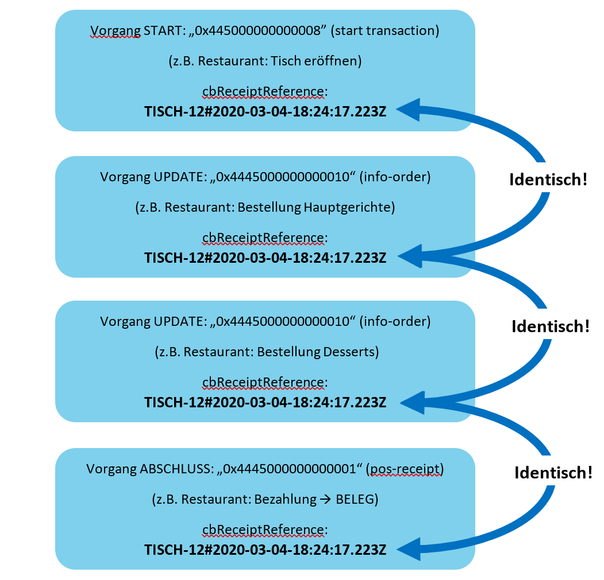
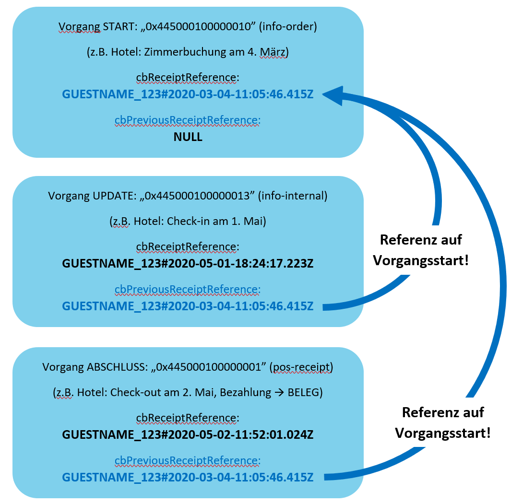

Einleitung
==========

Die fiskaltrust.Middleware übersetzt Geschäftsvorfälle in die Logik der
Digitalen Schnittstelle der Finanzverwaltung für Kassensysteme (DSFinV-K).

Kassenhersteller konzentrieren sich auf ihr Geschäft – fiskaltrust stellt
korrekte Fiskalisierung sicher.

Lediglich die Konfiguration einer „Cash box“ auf unserem fiskaltrust portal
(Webseite) ist erforderlich, um unsere Middleware herunterzuladen und auf dem
Kassenrechner zu starten. Fiskalisierung erfolgt durch einfache Aufrufe an
unseren Dienst.

Die „Cash box“ fungiert als Container Ihrer Konfiguration; Sie wählen eine
Technische Sicherheitseinrichtung (TSE) zum Signieren und Fiskalisieren von
Belegen neben weiteren Komponenten („helpers“), z.B. um Aufrufe nach dem
REST-Prinzip durchzuführen (statt standardmäßig mit SOAP).

Diese Sammlung liefert Beispiele für typische Geschäftsvorfälle in wichtigen
Branchen und übersetzt diese in JSON-code Aufrufe an unsere Middleware.

### Dokument Status

| Rev | Änderung                                             | geändert von | Änderungsdatum |
|-----|------------------------------------------------------|--------------|----------------|
| 00  | Dokumenterstellung, Grundsätzliches, JSON Beispiele  | Lars Mach    | 21.02.2020     |
| 01  | JSON Geschäftsvorfälle für diverse Branchen          | IT-Team      |                |
| 02  | Erweiterung um Wechselgeldrückgabe und Auftragssplit | K.Daniel     | 25.03.2020     |
| 03  | Überprüfung                                          | ausstehend   |                |

Grundsätzliches
===============

### Datenformat: JSON oder XML

Aufrufe an unsere Middleware können entweder im XML oder JSON Format erfolgen.

JSON (Java Script Objection Notation) ist durch als kompaktes Datenformat
charakterisiert, während XML Flexibilität im Umgang mit Hexadezimalzahlen
bietet, welche JSON nicht akzeptiert.

### Einsatz unserer Middleware als Dienst

Aufrufe an unsere Middleware erfolgen durch den Gebrauch bestimmter (auf
Hexadezimalzahlen basierender) Werte, um Funktionen auszulösen, die in unserer
Schnittstellen-Dokumentation beschrieben sind; davon können einige durch Flags
beeinflusst werden. Diese Flags müssen den Werten hinzuaddiert werden, z.B.
durch boolesche Operationen (ODER-Verknüpfung im Binärformat) oder Addieren der
Flag-Werte zu den Variablen (ohne gesetztes Flag) in jedem Zahlenformat.

### Eigene Variablen-Felder (branchen- oder fallspezifisch)

Unsere Middleware bietet Container-Variablen (string-Typen), um zusätzliche
Felder zu definieren. Diese können nach Belieben bezeichnet werden, z.B.
Firma/USt-ID für Rechnungen in „cbCustomer“ oder Hotelreservierungsdaten usw. in
„ftChargeItemCaseData“. Feldnamen und deren Werte müssen im untergeordneten JSON
Format in die Container-Variablen geschrieben werden (siehe unten).

### Eigene Variablen-Felder definieren durch untergeordneten JSON Codes

Einige der Middleware-Variablen dienen als Container für untergeordnete JSON
Codes; z.B. cbUser, cbCustomer, cbArea, ftChargeItemCaseData und andere (siehe
Interface-Dokumentation).

Eigene Variablen-Felder und deren Werte lassen sich wie folgt in JSON einbetten
(Beispiel):

>   “cbCustomer”: “{\\”company\\”: \\”fiskaltrust\\”, \\”VAT-No\\”:
>   \\”DE323821961\\”, \\”YourNumber\\”: 123 }”

>   NB: Umgekehrte Schrägstriche sind nötig, um Anführungszeichen im
>   eingebetteten JSON korrekt zu setzen.

Die erzeugt die folgenden Feldnamen/-wertepaare im Feld cbCustomer (formatiert):

{

“Company”: “fiskaltrust”,

“VAT-No”: “DE323821961”,

“YourNumber”: 123  
}

### JSON in XML einbetten

Einige Container-Variablen erfordern JSON format. Falls Middleware-Aufrufe in
XML erfolgen, sieht das o.g. JSON-Code Beispiel im Feld „cbCustomer” wie folgt
aus:

\<cbCustomer\>

\<![CDATA[ { ”Company”: ”fiskaltrust”, ”VAT-No”: ”DE323821961”, ”YourNumber”:123
} ]]\>

\</cbCustomer\>

### Implizites gegenüber explizitem Verfahren

In Deutschland sind nicht nur Kassenbelege zu fiskalisieren, sondern auch alle
Geschäftsvorfälle, die im Rahmen von Vorgängen auftreten können (z.B.
Zimmerbuchung, Lieferschein, Bestellungen).

Das durch die DSFinV-K beschriebene Verfahren erfordert, Vorgänge durch einen
„start transaction“-Aufruf zu öffnen, ggfls. gefolgt von weiteren Aufrufen – und
durch Belegausgabe zu schließen.

Es existieren Einschränkungen in Zusammenhang mit offenen Vorgängen (z.B.
maximale Anzahl gleichzeitig offener Vorgänge in TSEs sowie die Vorgabe, offene
Vorgänge zum Kassenabschluss zu schließen). Dies schafft Herausforderungen für
das Abbilden besonders lang andauernder Vorgänge, etwa bei Hotelbuchungen Monate
in Voraus mit weiteren Leistungen, bevor ein Beleg erstellt wird.

Die fiskaltrust.Middleware bietet hierzu eine einfache Lösung:

Aufrufen der Middleware für verschiedene Belegtypen (ftReceiptCase) kann ein
Flag (0x100000000) hinzugefügt werden, um o.g. Probleme zu vermeiden: Wir nennen
dies “implizites Verfahren”.

Das implizite Verfahren erfordert nur EINEN Aufruf, den unsere Middleware in
zwei Aufrufe übersetzt, um einen Vorgang zu öffnen und sofort zu schließen:
Keine offenen Vorgänge in der TSE.

Vorgänge durch Referenzen einklammern:

Die bei der ersten Transaktion eines Vorgangs im Feld „cbReceiptReference”
definierte Referenz dient dem Zusammenfassen aller zu diesem Vorgang gehörenden
Transaktionen.

Wenn der Referenz in cbReceiptReference bei jeder Transaktion des Vorgangs ein
Zeitstempel hinzugefügt wird (z.B. „VorgangXYZ\#20200211-112430“ für den
11.02.2020, 11:24:30 Uhr), dann kann in „cbPreviousReceiptReference“ stets auf
die erste Transaktion (Vorgangsbeginn) referiert werden, insbesondere bei
Belegerstellung. Dieses Konzept ist fakultativ und als Empfehlung gedacht.

Auf diese Weise kann mühelos ein Vorgang abgebildet werden, der sich über
mehrere Monate hinzieht, ohne Einschränkungen durch die TSE in Kauf nehmen zu
müssen.

In der JSON-Codesammlung werden Beispiele für das implizite Verfahren geliefert.

### Vorgänge verketten

Vorgänge können über „cbReceiptReference“, „cbPreviousReceiptReference“
geklammert werden. Hierbei ist zwischen expliziter und impliziter Vorgehensweise
zu unterscheiden:

#### **Explizite Vorgehensweise**

Bei expliziter Vorgehensweise wird in der TSE ein Vorgang offengehalten – dieser
ist mit Kassenabschluss zu beenden. Es ist zu beachten, dass eine TSE nicht
beliebig viele offene Vorgänge gleichzeitig speichern kann.

Diese Methode eignet sich z.B. in der Gastronomie (alle Bestellungen eines
Tisches) oder allen Vorgängen, die über den Kassenabschluss nicht hinausgehen.

#### Verkettung bei expliziter Vorgehensweise

Eine cbReceiptReference wird beim Vorgangsstart vergeben. Diese wird für alle
Transaktionen des Vorgangs beibehalten, da der Vorgang in der TSE geklammert
wird.

#### Verkettung bei impliziter Vorgehensweise

Eine cbReceiptReference wird beim Vorgangsstart vergeben. Auf diese kann für
alle Transaktionen des Vorgangs mit cbPreviousReceiptReference verwiesen werden
(empfohlen), mindestens jedoch bei Vorgangsabschluss (Belegerstellung).

Da die Klammerung außerhalb der TSE geschieht und alle impliziten Aufrufe
jeweils in sich geschlossene Vorgänge innerhalb der TSE sind, sind identische
cbReceiptReference nicht empfohlen.

Wir empfehlen eine Kombination aus einer jeweils identischen Referenz (numerisch
oder alphanumerisch) gefolgt von einem Zeitstempel zur Unterscheidung (z.B.
durch \# getrennt) für jede Transaktion des Vorgangs – damit lassen sich alle
Transaktionen eines Vorgangs im Nachhinein identifizieren und chronologisch
sortieren, falls nicht alle Transaktionen des Vorgangs per
cbPreviousReceiptReference mit dem Vorgangsstart verkettet sind.

Der Befehl „0x4445000000000008 start-transaction-receipt“ darf NICHT verwendet
werden – er ist nur bei expliziter Vorgehensweise zum Starten eines Vorgangs
zulässig (siehe dort).

### Stornieren oder Ändern von Belegen

Fiskalisierung bedeutet manipulationsgeschützte Speicherung von Belegen; jedwede
Änderungen oder Löschungen sind unmöglich.

Dies erfordert geeignete Herangehensweisen zum Stornieren oder Ändern von
(Teil-)Belegen.

Wenn durch eine TSE signierte Belege oder Positionen darin zu stornieren oder zu
ändern sind, ist eine Gegenbuchung nötig, in der betroffene Artikel und
Bezahlungen negativ dargestellt werden.

Gegenbuchungsbelege referenzieren per cbPreviousReceiptReference auf den
Ursprungsbeleg.

Diese Vorgehensweise wird auch zum Aufteilen von Bestellungen eingesetzt
(Tischgäste bitten um separate Zahlungen im Restaurant) oder beim Zusammenführen
von Transaktionen. Artikel aus einem ursprünglichen Vorgang (Tisch) werden
gegengebucht und in einen oder mehrere neuen Vorgänge übertragen.

Beispiele für solche typischen Geschäftsvorfälle sind in unserer JSON Sammlung
aufgeführt.

### Header-Daten in allen JSON Beispielen

*Sämtliche JSON Code Beispiele dieser Sammlung verwenden die folgenden
identischen Werte (IDs):*

ftCashBoxID: c094f242-91d5-4343-9c54-bce85f70d0d6 (fiskaltrust.cashbox ID, im
Portal zugewiesen)

cbTerminalID: CashDeskMaker_Model_1 (einzigartige ID [UID] der Registrierkasse)

ftPosSystemID: b3dc6573-96d9-e611-80f7-5065f38adae1 (optionale UID der
Kassensoftware-Version)

JSON Aufrufe
============

Funktionsaufrufe
----------------

### Anmeldung einer neuen Registrierkasse 

Jede neue Cash box (Registrierkasse) muss durch folgenden Aufruf einmalig
angemeldet werden:

| { "ftReceiptCase": 4919338172267102211, "ftCashBoxID": "c094f242-91d5-4343-9c54-bce85f70d0d6", "ftPosSystemId": "b3dc6573-96d9-e611-80f7-5065f38adae1", "cbTerminalID": "CashDeskMaskerModel_Serial123“, "cbReceiptReference": "PutYourOwnReferenceHERE", "cbReceiptMoment": "\\/Date(1583496016)\\/", "cbChargeItems": [], "cbPayItems": [] } | Kommentare: 0x4445 0001 0000 0003 “initial operation receipt” („implicit“ Flag erforderlich) UNIX Zeitstempel |
|------------------------------------------------------------------------------------------------------------------------------------------------------------------------------------------------------------------------------------------------------------------------------------------------------------------------------------------------|---------------------------------------------------------------------------------------------------------------|

### Stilllegung einer Registrierkasse

Eine Registrierkasse wird durch folgenden – nicht umkehrbaren – Aufruf
stillgelegt:

| { "ftReceiptCase": 4919338172267102212, "ftCashBoxID": "c094f242-91d5-4343-9c54-bce85f70d0d6", "ftPosSystemId": "b3dc6573-96d9-e611-80f7-5065f38adae1", "cbTerminalID": "CashDeskMaskerModel_Serial123“, "cbReceiptReference": "PutYourOwnReferenceHERE", "cbReceiptMoment": "\\/Date(1583493313)\\/", "cbChargeItems": [], "cbPayItems": [] } | Kommentare: 0x4445 0001 0000 0004 “out of operation receipt” („implicit“ Flag erforderlich) UNIX Zeitstempel |
|------------------------------------------------------------------------------------------------------------------------------------------------------------------------------------------------------------------------------------------------------------------------------------------------------------------------------------------------|--------------------------------------------------------------------------------------------------------------|

Ladengeschäfte: Registrierkassen
--------------------------------

### Scannerkassen

Scannerkassen erfassen Artikel innerhalb kurzer Zeit und schließen unmittelbar
mit dem Zahlvorgang ab (bar, Kartenzahlung).

Gemäß Vereinfachungsregeln der DSFinV-K (Anlage H) startet der Vorgang mit dem
Scannen des ersten Artikels, ohne dass Updates für Folgeartikel nötig sind. Der
Vorgang wird durch einen Zahlungsbeleg geschlossen, in dem alle übrigen Artikel
aufgelistet sind.

Dies gilt für ähnliche Kassen ebenso (z.B. manuelle Artikelerfassung durch eine
Tastatur).

Beispiel:

Explizites Verfahren, Aufruf 1) Vorgang wird mit dem ersten Artikel gestartet
(1x Kleid) und 2) abgeschlossen (mit allen übrigen Artikeln: 1x Jeans, 2x
Shirts) sowie erfolgter Zahlungsart (hier: bar).

| { "ftReceiptCase": 4919338167972134920, "ftCashBoxID": "c094f242-91d5-4343-9c54-bce85f70d0d6", "ftPosSystemId": "b3dc6573-96d9-e611-80f7-5065f38adae1", "cbTerminalID": "CashDeskMasker_Model_1", "cbReceiptReference": "SALE_20200204\#11354513", "cbReceiptMoment": "\\/Date(1580812513)\\/ ", "cbArea": "Outlet_47798_Krefeld", "cbChargeItems": [ { "ftChargeItemCase": 4919338167972134929, "Description": "Kleid_Azteken-Stil_schwarz-AOP", "Quantity": 1.0, "Amount": 119.99, "VATRate": 19.00, "VATAmount": 19.16, "ProductGroup": "Damenoberbekleidung", "ProductNumber": "18.908.82.9816.99A0.42", "ProductBarcode": "4062033264091", "Unit": "Article", "UnitQuantity": 1, "UnitPrice": 119.99, "Moment":"2020-02-04T11:35:45.133Z" } ], "cbPayItems": [] }                                                                                                                                                                                                                                                                                                                                                                                                                                                                                                                                                                                         | *Erster Aufruf:* HEX 0x445000000000008 d.h. „start transaction” cbReceiptReference startet einen Vorgang mit ID “SALE_20200204\#11350013” (“11354513” als Zeitstempel) HEX 0x4445000000000011 d.h. “delivery normal, 19%” Erster Artikel wird genannt:                                                                                                                                                                                                         |
|                                                                                                                                                                                                                                                                                                                                                                                                                                                                                                                                                                                                                                                                                                                                                                                                                                                                                                                                                                                                                                                                                                                                                                                                                                                                                                                                                                | schwarzes Kleid;                                                                                                                                                                                                                                                                                                                                                                                                                                               |
|                                                                                                                                                                                                                                                                                                                                                                                                                                                                                                                                                                                                                                                                                                                                                                                                                                                                                                                                                                                                                                                                                                                                                                                                                                                                                                                                                                | Preis €119.99 Produktcode des Händlers Barcode, z.B. European Article Number (EAN) Zeitstempel der Erfassung Noch ohne Zahlungen; leeres Feld-Array „cbPayItems“ ist jedoch erforderlich                                                                                                                                                                                                                                                                       |
|----------------------------------------------------------------------------------------------------------------------------------------------------------------------------------------------------------------------------------------------------------------------------------------------------------------------------------------------------------------------------------------------------------------------------------------------------------------------------------------------------------------------------------------------------------------------------------------------------------------------------------------------------------------------------------------------------------------------------------------------------------------------------------------------------------------------------------------------------------------------------------------------------------------------------------------------------------------------------------------------------------------------------------------------------------------------------------------------------------------------------------------------------------------------------------------------------------------------------------------------------------------------------------------------------------------------------------------------------------------|----------------------------------------------------------------------------------------------------------------------------------------------------------------------------------------------------------------------------------------------------------------------------------------------------------------------------------------------------------------------------------------------------------------------------------------------------------------|
| { "ftReceiptCase": 4919338167972134913, "ftCashBoxID": "c094f242-91d5-4343-9c54-bce85f70d0d6", "ftPosSystemId": "b3dc6573-96d9-e611-80f7-5065f38adae1", "cbTerminalID": "CashDeskMasker_Model_1", "cbReceiptReference": "SALE_20200204\#11360013", “cbPreviousReceiptReference”: “SALE_20200204\#11354513”, "cbReceiptMoment": "\\/Date(1580812590)\\/", "cbArea": "Outlet_47798_Krefeld", "cbChargeItems": [ { "ftChargeItemCase": 4919338167972134929, "Description": "Jeans_Flared_leg", "Quantity": 1.0, "Amount": 79.99, "VATRate": 19.00, "VATAmount": 12.77, "CostCenter": "1", "ProductGroup": "Damenoberbekleidung", "ProductNumber": "18.003.71.9238.57Z4.40.32", "ProductBarcode": "4061956300718", "Unit": "Article", "UnitQuantity": 1, "UnitPrice": 79.99, "Moment": "2020-02-04T11:36:10.133Z" }, { "ftChargeItemCase": 4919338167972134929, "Description": "Jerseyshirt_V-Ausschnitt_Terracotta", "Quantity": 2.0, "Amount": 35.98, "VATRate": 19.00, "VATAmount": 5.7447, "ProductGroup": "Damenoberbekleidung", "ProductNumber": "18.905.32.9415.2745.40", "ProductBarcode": "4062033036155", "Unit": "Article", "UnitQuantity": 1, "UnitPrice": 17.99, "Moment": "2020-02-04T11:36:10.133Z" } ], "cbPayItems": [ { "ftPayItemCase": 4919338167972134913, "Amount": 235.96, "Description": "Bar", "Moment": "2020-02-05T11:36:45.133Z" } ] } | *Zweiter Aufruf:* HEX 0x4445000000000001 d.h. “pos-receipt” Referenz des Aufrufs Referenz zu Vorgangsstart Restliche erfasste Artikel… HEX 0x4445000000000011 d.h. delivery normal 2 identische Artikel erfasst Gesamtpreis aller 2 Artikel Gesamt USt-Betrag 2 Artikel Preis pro Shirt HEX 0x4445000000000001 d.h. cash payment national                                                                                                                      |
|                                                                                                                                                                                                                                                                                                                                                                                                                                                                                                                                                                                                                                                                                                                                                                                                                                                                                                                                                                                                                                                                                                                                                                                                                                                                                                                                                                | (Barzahlung in Euro)                                                                                                                                                                                                                                                                                                                                                                                                                                           |

### Scannerkassen – falsch gescannten Artikel sofort stornieren

Falls Artikel fälschlicherweise erfasst werden, können diese unmittelbar in der
cbChargeItems Liste gegengebucht werden.

Beispiel:

Explizites Verfahren, Aufruf 1) Vorgang startet mit Erfassung des ersten
Artikels (1x Joghurt); dann wird 2) versehentlich der Barcode einer einzelnen
Flasche aus einem Sechserpack erfasst – und sofort storniert, da das Sechserpack
einen eigenen Barcode besitzt (mit Preisvorteil); der korrekte Endbetrag wird
per Debitkarte gezahlt.

| { "ftReceiptCase": 4919338167972134920, "ftCashBoxID": "c094f242-91d5-4343-9c54-bce85f70d0d6", "ftPosSystemId": "b3dc6573-96d9-e611-80f7-5065f38adae1", "cbTerminalID": "CashDeskMasker_Model_1", "cbReceiptReference": "SALE_20200204\#11354513", "cbReceiptMoment": “\\/Date(1580812545)\\/”, "cbArea": "Supermarket_47807_Krefeld", "cbChargeItems": [ { "ftChargeItemCase": 4919338167972134930, "Description": "Yoghurt_greek_almond", "Quantity": 1.0, "Amount": 0.69, "VATRate": 7.00, "VATAmount": 0.04514, "ProductGroup": "FOOD_milk", "ProductBarcode": "4025500170035", "Unit": "Article", "UnitQuantity": 1, "UnitPrice": 0.69, "Moment":"2020-02-04T11:35:45.133Z" } ], "cbPayItems": [] }                                                                                                                                                                                                                                                                                                                                                                                                                                                                                                                                                                                                                                                                                                                                                                                                                                                                        | *Erster Aufruf:* HEX 0x445000000000008 d.h. „start transaction” cbReceiptReference startet einen Vorgang mit ID “SALE_20200204\#11350013” HEX 0x4445000000000012 “delivery discounted 7%” Erster Artikel wird erfasst: Joghurt; Preis €0.69 Produktcode des Händlers Barcode, z.B. European Article Number (EAN) Zeitstempel der Erfassung Noch ohne Zahlungen; leeres Feld-Array „cbPayItems“ ist jedoch erforderlich                                                                                                                                         |
|---------------------------------------------------------------------------------------------------------------------------------------------------------------------------------------------------------------------------------------------------------------------------------------------------------------------------------------------------------------------------------------------------------------------------------------------------------------------------------------------------------------------------------------------------------------------------------------------------------------------------------------------------------------------------------------------------------------------------------------------------------------------------------------------------------------------------------------------------------------------------------------------------------------------------------------------------------------------------------------------------------------------------------------------------------------------------------------------------------------------------------------------------------------------------------------------------------------------------------------------------------------------------------------------------------------------------------------------------------------------------------------------------------------------------------------------------------------------------------------------------------------------------------------------------------------------------------|----------------------------------------------------------------------------------------------------------------------------------------------------------------------------------------------------------------------------------------------------------------------------------------------------------------------------------------------------------------------------------------------------------------------------------------------------------------------------------------------------------------------------------------------------------------|
| { "ftReceiptCase": 4919338167972134913, "ftCashBoxID": "c094f242-91d5-4343-9c54-bce85f70d0d6", "ftPosSystemId": "b3dc6573-96d9-e611-80f7-5065f38adae1", "cbTerminalID": "CashDeskMasker_Model_1", "cbReceiptReference": "SALE_20200204\#11360013", “cbPreviousReceiptReference”: “SALE_20200204\#11354513”, "cbReceiptMoment": “\\/Date(1580812590)\\/”, "cbArea": "Supermarket_478097_Krefeld", "cbChargeItems": [ { "ftChargeItemCase": 4919338167972134930, "Description": "XYBrand_Lemonade", "Quantity": 1.0, "Amount": 1.29, "VATRate": 7.00, "VATAmount": 0.08439, "ProductGroup": "FOOD_drinks_nonAlc", "ProductBarcode": "4061956300718", "Unit": "Bottle", "UnitQuantity": 1, "UnitPrice": 1.29, "Moment": "2020-02-04T11:36:10.133Z" }, { "ftChargeItemCase": 4919338167972134930, "Description": "XYBrand_Lemonade", "Quantity": -1.0, "Amount": -1.29, "VATRate": 7.00, "VATAmount": -0.08439, "ProductGroup": "FOOD_drinks_nonAlc", "ProductBarcode": "4061956300718", "Unit": "Bottle", "UnitQuantity": 1, "UnitPrice": 1.29, "Moment": "2020-02-04T11:36:10.133Z" }, { "ftChargeItemCase": 4919338167972134930, "Description": "XYBrand_Lemonade_6pack", "Quantity": 1.0, "Amount": 6.50, "VATRate": 7.00, "VATAmount": 0.08439, "ProductGroup": "FOOD_drinks_nonAlc", "ProductBarcode": "4061956300728", "Unit": "SIXPACK", "UnitQuantity": 1, "UnitPrice": 6.50, "Moment": "2020-02-04T11:36:10.133Z" } ], "cbPayItems": [ { "ftPayItemCase": 4919338167972134916, "Amount": 7.19, "Description": "Sparkasse_PIN", "Moment": "2020-02-05T11:36:32.133Z" } ] } | *Zweiter Aufruf:* HEX 0x4445000000000001 d.h. “pos-receipt” Referenz zu aktuellem Aufruf                                                                                                                                                                                                                                                                                                                                                                                                                                                                       |
|                                                                                                                                                                                                                                                                                                                                                                                                                                                                                                                                                                                                                                                                                                                                                                                                                                                                                                                                                                                                                                                                                                                                                                                                                                                                                                                                                                                                                                                                                                                                                                                 | Referenz zu Vorgangsstart Restliche erfasste Artikel… HEX 0x4445000000000012 “delivery discounted 7%” 1x Flasche Limonade… …was scanned wrongly! HEX 0x4445000000000012 “delivery discounted 7%” Negative Werte: 1x Flasche Limonade… …wird aus Liste entfernt! (z.B. EAN der Flasche statt EAN des Sechserpacks) Artikelpreis bleibt positiv HEX 0x4445000000000012 “delivery discounted 7%” Sechserpack hinzugefügt HEX 0x4445000000000004 d.h. “debit card payment”                                                                                         |

### Scannerkassen – Mehrere Zahlarten und Wechselgeld-Rückgabe

Bei Bezahlung mit unterschiedlichen Zahlmitteln und großen Scheinen ist eine
Überzahlung möglich.

Beispiel:

Implizites Verfahren, Kauf eines Artikels und Bezahlung mit mehreren Zahlarten
(EC-Karte und Bar) und Rückzahlung des Wechselgeldes als Differenz zwischen
Leistungsbetrag und Zahlbetrag.

| { "ftReceiptCase": 4919338172267102209‬, "ftCashBoxID": "c094f242-91d5-4343-9c54-bce85f70d0d6", "ftPosSystemId": "b3dc6573-96d9-e611-80f7-5065f38adae1", "cbTerminalID": "CashDeskMasker_Model_1", "cbReceiptReference": "SALE_20200204\#11354514", "cbReceiptMoment": “\\/Date(1580812545)\\/”, "cbArea": "Supermarket_47807_Krefeld", "cbChargeItems": [ { "ftChargeItemCase": 4919338167972134914‬, "Description": "Yoghurt_greek_almond", "Quantity": 10.0, "Amount": 6.90, "VATRate": 7.00, "VATAmount": 0.4514, "ProductGroup": "FOOD_milk", "ProductBarcode": "4025500170035", "Unit": "Article", "UnitQuantity": 1, "UnitPrice": 0.69, "Moment":"2020-02-04T11:35:45.133Z" } ], "cbPayItems": [ { "ftPayItemCase": 4919338167972134916, "Amount": 4.00, "Description": "Sparkasse_PIN", "Moment": "2020-02-05T11:36:32.133Z" }, { "ftPayItemCase": 4919338167972134913‬, "Amount": 5.00, "Description": "Bar", "Moment": "2020-02-05T11:36:32.133Z" }, { "ftPayItemCase": 4919338167972134923‬‬, "Amount": -2.10, "Description": "Bar", "Moment": "2020-02-05T11:36:32.133Z" } ] } | HEX 0x4445000100000001 d.h. „pos-receipt“ cbReceiptReference startet einen Vorgang mit ID “SALE_20200204\#11350014” HEX 0x4445000000000002 “undefined service 7%” Artikel wird erfasst: Joghurt; Preis €0.69 Produktcode des Händlers Barcode, z.B. European Article Number (EAN) Zeitstempel der Erfassung HEX 0x4445000000000004 d.h. “debit card payment” HEX 0x4445000000000001 d.h. “cash payment in national currency” HEX 0x444500000000000B d.h. “change in national currency”, negatives Wechselgeld |
|---------------------------------------------------------------------------------------------------------------------------------------------------------------------------------------------------------------------------------------------------------------------------------------------------------------------------------------------------------------------------------------------------------------------------------------------------------------------------------------------------------------------------------------------------------------------------------------------------------------------------------------------------------------------------------------------------------------------------------------------------------------------------------------------------------------------------------------------------------------------------------------------------------------------------------------------------------------------------------------------------------------------------------------------------------------------------------------|---------------------------------------------------------------------------------------------------------------------------------------------------------------------------------------------------------------------------------------------------------------------------------------------------------------------------------------------------------------------------------------------------------------------------------------------------------------------------------------------------------------|

Lieferscheine
-------------

### Erstellen eines Lieferscheins

Laut “Kassensicherungsverordnung” (KassSichV) sind im Rahmen von Vorgängen auch
Ereignisse wie das Erstellen eines Lieferscheins zu fiskalisieren.

Dies wird durch einen Aufruf „delivery note“ erreicht, der Artikel, jedoch keine
Zahlungen enthält.

Beispiel:

Implizites Vorgehen – drei Artikel (1x Funghi, 2x Margherita Pizzas) werden
erfasst (Tastatur, Scanner), um einen Lieferschein über die Middleware durch die
TSE signieren zu lassen:

| { "ftReceiptCase": 4919338172267102223, "ftCashBoxID": "c094f242-91d5-4343-9c54-bce85f70d0d6", "ftPosSystemId": "b3dc6573-96d9-e611-80f7-5065f38adae1", "cbTerminalID": "CashDeskMasker_Model_1", "cbReceiptReference": "DELIVERY_234_20200204\#113410013", "cbPreviousReceiptReference": "ORDER_234_20200204\#112022008", "cbReceiptMoment": “\\/Date(1580812980)\\/”, "cbArea": "PizzaDeliveryShop_Cologne_02", "cbChargeItems": [ { "ftChargeItemCase": 4919338167972134930, "Description": " Pizza_Funghi", "Quantity": 1.0, "Amount": 0.0, "VATRate": 7.00, "VATAmount": 0.0, "ProductGroup": "Speisen_ausserHaus", "ProductNumber": "06", "UnitPrice": 6.00, "Moment":"2020-02-04T11:42:45.133Z" }, { "ftChargeItemCase": 4919338167972134930, "Description": " Pizza_Margherita", "Quantity": 2.0, "Amount": 0.0, "VATRate": 7.00, "VATAmount": 0.0, "ProductGroup": "Speisen_ausserHaus", "ProductNumber": "01", "UnitPrice": 4.00, "Moment":"2020-02-04T11:42:52.133Z" } ], "cbPayItems": [] } | Kommentare: HEX 0x444500010000000F “delivery note” (implizit) Referenz des Lieferscheins Referenz auf Bestellung HEX 0x4445000000000012 “delivery discounted 7%” HEX 0x4445000000000012 “delivery discounted 7%” |
|---------------------------------------------------------------------------------------------------------------------------------------------------------------------------------------------------------------------------------------------------------------------------------------------------------------------------------------------------------------------------------------------------------------------------------------------------------------------------------------------------------------------------------------------------------------------------------------------------------------------------------------------------------------------------------------------------------------------------------------------------------------------------------------------------------------------------------------------------------------------------------------------------------------------------------------------------------------------------------------------------------|------------------------------------------------------------------------------------------------------------------------------------------------------------------------------------------------------------------|

Hotellerie
----------

### Zimmerbuchung

Zimmerbuchungen können lange im Voraus geschehen. Sie sind als wesentlicher
Bestandteil eines Vorgangs abzubilden, d.h. meist als erstes Ereignis darin.
Falls eine unverbindliche Reservierung vorliegt, die bei Nichtanreise ohne
Kosten für den Gast verfällt, folgt diesem (Start-)Aufruf kein weiterer.

Wir empfehlen, den Vorgang in dem Fall um eine Transaktion („kostenfreies
Storno“) zu erweitern.

-   Wegen der langen Dauer eines solchen Vorgangs wird die implizite
    Vorgehensweise gewählt, da der Vorgang nicht vor Kassenabschluss beendet
    werden kann.

-   Als cbReceiptReference dient eine fiktive Reservierunsnummer nebst
    Vorgangsbeginn:  
    „123456789\#2020-02-03T13:32:45.133Z“ Res.nr. 123456789 vom 3.2.2020 um
    13:32:45

| { „ftReceiptCase“:4919338172267102488, “ftCashBoxID”: “c094f242-91d5-4343-9c54-bce85f70d0d6”, “ftPosSystemId”: “b3dc6573-96d9-e611-80f7-5065f38adae1”, “cbTerminalID”: “CashDeskMaskerModel_Serial123“, “cbReceiptReference”: “123456789\#2020-02-03T13:32:45.133Z”, “cbReceiptMoment”: “\\/Date(1583152365)\\/”, "cbChargeItems": [ { "ftChargeItemCase": 4919338167972135242, "Description": " Double_Room_Economy ", "Quantity": 1.0, "Amount": 125.0, "VATRate": 7.00, "VATAmount": 8.178, "ProductGroup": "Accomodation", "UnitPrice": 125.00, "Moment":"2020-02-04T11:42:45.133Z" “ftChargeItemCaseData”: “{ \\”Anreise\\”: \\”01.05.2020 – 18:00 Uhr\\”, \\”Gastname \\”: \\”Max Mustermann\\” }” } ], “cbPayItems”: [] } | Kommentare: HEX 0x4445000100000010 “info-order”, “implicit Flag” Vorgangsreferenz (Beginn)                                                                                                                                                                                                          |
|                                                                                                                                                                                                                                                                                                                                                                                                                                                                                                                                                                                                                                                                                                                                  | mit Zeitstempel HEX 0x444500000000001A “other services 7% USt) Gebuchter Zimmerpreis Optional: Angaben zur Buchung (in eigenen Feldern „Anreise“ und „Gastname“) in Container-Variable Ohne Vorauszahlung                                                                                           |
|----------------------------------------------------------------------------------------------------------------------------------------------------------------------------------------------------------------------------------------------------------------------------------------------------------------------------------------------------------------------------------------------------------------------------------------------------------------------------------------------------------------------------------------------------------------------------------------------------------------------------------------------------------------------------------------------------------------------------------|-----------------------------------------------------------------------------------------------------------------------------------------------------------------------------------------------------------------------------------------------------------------------------------------------------|

### Zimmerbuchung kostenfrei stornieren 

Das im vorhergehenden Beispiel gebuchte Zimmer wird vor Anreise durch den Gast
kostenfrei storniert oder der Gast reist nicht an (Buchungssystem storniert die
Reservierung automatisch).

Es wird eine Transaktion wie oben erzeugt – jedoch mit negativem ftChargeItem
als Gegenbuchung:

| { „ftReceiptCase“: 4919338172267102224, “ftCashBoxID”: “c094f242-91d5-4343-9c54-bce85f70d0d6”, “ftPosSystemId”: “b3dc6573-96d9-e611-80f7-5065f38adae1”, “cbTerminalID”: “CashDeskMaskerModel_Serial123“, “cbPreviousReceiptReference”: “123456789\#2020-02-03T13:32:45.133Z”, “cbReceiptReference”: “123456789\#2020-05-01T18:05:00.000Z ”, “cbReceiptMoment”: “\\/Date(1588349100)\\/”, "cbChargeItems": [ { "ftChargeItemCase": 4919338167972135242, "Description": " Double_Room_Economy ", "Quantity": -1.0, "Amount": -125.0, "VATRate": 7.00, "VATAmount": -8.178, "ProductGroup": "Accomodation", "UnitPrice": 125.00, "Moment":"2020-02-04T11:42:45.133Z" “ftChargeItemCaseData”: “{ \\”Anreise\\”: \\”01.05.2020 – 18:00 Uhr\\”, \\”Gastname \\”: \\”Max Mustermann\\” }” } ], “cbPayItems”: [] } | Kommentare: HEX 0x4445000100000010 “info-order”, “implicit Flag” Referenz auf Vorgangsstart Storniert: 1.5.2020, 18:05 HEX 0x444500000000001A “other services 7% USt) Gegenbuchung: Anzahl, Zimmerpreis und USt negativ Produktpreis bleibt positiv (informative Angabe) Optional: Angaben zur Buchung (in eigenen Feldern „Anreise“ und „Gastname“) in Container-Variable Keine Stornokosten |
|------------------------------------------------------------------------------------------------------------------------------------------------------------------------------------------------------------------------------------------------------------------------------------------------------------------------------------------------------------------------------------------------------------------------------------------------------------------------------------------------------------------------------------------------------------------------------------------------------------------------------------------------------------------------------------------------------------------------------------------------------------------------------------------------------------|-----------------------------------------------------------------------------------------------------------------------------------------------------------------------------------------------------------------------------------------------------------------------------------------------------------------------------------------------------------------------------------------------|

Gastronomie
-----------

### Auftragssplit

Die Aufteilung eines bereits begonnen Vorgangs trifft man sehr häufig in der
Gastronomie an. Hierbei bestellen mehrere Gäste an einem Tisch Essen und
Getränke, wobei erst später klar wird, dass jeder Gast seinen Verzehr separat
bezahlt. D. h. der zuvor tischbezogene Bestellvorgang wird in mehrere
personenbezogene Bezahlvorgänge mit Belegen abgeschlossen.

Abgebildet kann dies durch die Aufteilung der angesammelten Bestellvorfälle mit
Erstellung des ersten Belegs und anschließend ggf. mit jedem weiteren Beleg bis
die Gesamtsumme ausgeglichen ist. Dabei werden jeweils die zu zahlenden
Bestellpositionen einem neuen Vorgang (Bestellung) zugeordnet. Das Neuzuordnen
geschieht durch negative Gegenbuchungen auf den ursprünglichen Vorgang („Beleg“)
und Hinzubuchen dieser Positionen auf einen neu erstellten Vorgang („Beleg“).

Bei dieser Vorgangssequenz wird eine Referenz des neu erzeugten Belegs auf den
ursprünglichen Vorgang mittels „cbPreviousReceiptReference“ gesetzt.

Beispiel:

1.  Bestellvorgänge von drei Personen an Tisch 10. Bestellt werden ein
    Schnitzel, zwei Bier und eine Cola.

| { “ftReceiptCase“: 4919338172267102224, “ftCashBoxID”: “c094f242-91d5-4343-9c54-bce85f70d0d6”, “ftPosSystemId”: “b3dc6573-96d9-e611-80f7-5065f38adae1”, “cbTerminalID”: “CashDeskMaskerModel_Serial123“, “cbReceiptReference”: “1234\#2020-02-03T13:32:45.133Z”, “cbReceiptMoment”: “2020-02-03T13:32:45.133Z”, “cbArea”: “10”, "cbChargeItems": [ { "ftChargeItemCase": 4919338167972134913, "Description": " Schnitzel", "Quantity": 1.0, "Amount": 12.00, "VATRate": 19.00, "VATAmount": 1.92, "ProductGroup": "Gericht", "UnitPrice": 12.00, "Moment":“2020-02-03T13:32:45.133Z” }, { "ftChargeItemCase": 4919338167972134913, "Description": " Bier", "Quantity": 2.0, "Amount": 2.00, "VATRate": 7.00, "VATAmount": 0.13, "ProductGroup": "Getränk", "UnitPrice": 1.00, "Moment":“2020-02-03T13:32:45.133Z” }, { "ftChargeItemCase": 4919338167972134913, "Description": " Cola", "Quantity": 1.0, "Amount": 1.20, "VATRate": 7.00, "VATAmount": 0.08, "ProductGroup": "Getränk", "UnitPrice": 1.20, "Moment":“2020-02-03T13:32:45.133Z” } ], “cbPayItems”: [] } | Kommentare: HEX 0x4445000100000010 “info-order”, “implicit Flag” Vorgangsreferenz (Beginn)                                                                                                                                                                                                                                          |
|                                                                                                                                                                                                                                                                                                                                                                                                                                                                                                                                                                                                                                                                                                                                                                                                                                                                                                                                                                                                                                                                        | mit Zeitstempel An Tisch 10 HEX 0x4445000000000001 “undef. Type of service 19% USt) 1 bestelltes Schnitzel HEX 0x4445000000000002 “undef. Type of service 7% USt) 2 bestellte Bier HEX 0x4445000000000002 “undef. Type of service 7% USt)                                                                                           |
|------------------------------------------------------------------------------------------------------------------------------------------------------------------------------------------------------------------------------------------------------------------------------------------------------------------------------------------------------------------------------------------------------------------------------------------------------------------------------------------------------------------------------------------------------------------------------------------------------------------------------------------------------------------------------------------------------------------------------------------------------------------------------------------------------------------------------------------------------------------------------------------------------------------------------------------------------------------------------------------------------------------------------------------------------------------------|-------------------------------------------------------------------------------------------------------------------------------------------------------------------------------------------------------------------------------------------------------------------------------------------------------------------------------------|

2.  bestellte Cola

3.  Ein Gast zahlt seinen Anteil, das Schnitzel und ein Bier in bar. D.h.
    Aufteilung des Ursprungvorgangs in zwei Vorgänge.

2 a) Gegenbuchung von Schnitzel und eines Biers im Ursprungsvorgang:

| { “ftReceiptCase“: 4919338172267102224, “ftCashBoxID”: “c094f242-91d5-4343-9c54-bce85f70d0d6”, “ftPosSystemId”: “b3dc6573-96d9-e611-80f7-5065f38adae1”, “cbTerminalID”: “CashDeskMaskerModel_Serial123“, “cbReceiptReference”: “1234\#2020-02-03T13:32:45.133Z”, “cbReceiptMoment”: “2020-02-03T13:32:45.133Z”, “cbArea”: “10”, "cbChargeItems": [ { "ftChargeItemCase": 4919338167972134913, "Description": " Schnitzel", "Quantity": -1.0, "Amount": -12.00, "VATRate": 19.00, "VATAmount": -1.92, "ProductGroup": "Gericht", "UnitPrice": 12.00, "Moment":“2020-02-03T13:32:45.133Z” }, { "ftChargeItemCase": 4919338167972134913, "Description": " Bier", "Quantity":-1 .0, "Amount": -1.00, "VATRate": 7.00, "VATAmount": -0.08, "ProductGroup": "Getränk", "UnitPrice": 1.00, "Moment":“2020-02-03T13:32:45.133Z” } ], “cbPayItems”: [] } | Kommentare: HEX 0x4445000100000010 “info-order”, “implicit Flag” Identische Vorgangsreferenz An Tisch 10 HEX 0x4445000000000001 “undef. Type of service 19% USt) -1 bestelltes Schnitzel HEX 0x4445000000000002 “undef. Type of service 7% USt) -1 bestelltes Bier |
|-------------------------------------------------------------------------------------------------------------------------------------------------------------------------------------------------------------------------------------------------------------------------------------------------------------------------------------------------------------------------------------------------------------------------------------------------------------------------------------------------------------------------------------------------------------------------------------------------------------------------------------------------------------------------------------------------------------------------------------------------------------------------------------------------------------------------------------------------|--------------------------------------------------------------------------------------------------------------------------------------------------------------------------------------------------------------------------------------------------------------------|

2 b) Buchung von Schnitzel und eines Biers als neuen Vorgang mit Beleg:

| { “ftReceiptCase“: 4919338172267102209, “ftCashBoxID”: “c094f242-91d5-4343-9c54-bce85f70d0d6”, “ftPosSystemId”: “b3dc6573-96d9-e611-80f7-5065f38adae1”, “cbTerminalID”: “CashDeskMaskerModel_Serial123“, “cbReceiptReference”: “12345\#2020-02-03T13:50:30.133Z”, “cbReceiptMoment”: “2020-02-03T13:50:30.133Z”, “cbArea”: “10”, “cbPreviousReceiptReference”: “1234\#2020-02-03T13:32:45.133Z”, "cbChargeItems": [ { "ftChargeItemCase": 4919338167972134913, "Description": " Schnitzel", "Quantity": 1.0, "Amount": 12.00, "VATRate": 19.00, "VATAmount": 1.92, "ProductGroup": "Gericht", "UnitPrice": 12.00, "Moment":“2020-02-03T13:32:45.133Z” }, { "ftChargeItemCase": 4919338167972134913, "Description": " Bier", "Quantity": 1 .0, "Amount": 1.00, "VATRate": 7.00, "VATAmount": 0.08, "ProductGroup": "Getränk", "UnitPrice": 1.00, "Moment":“2020-02-03T13:32:45.133Z” } ], “cbPayItems”: [ { "ftPayItemCase": 4919338167972134913, "Amount": 13.00, "Description": "Bar", "Moment": "2020-02-03T13:50:30.133Z" } ] } | Kommentare: HEX 0x4445000100000001 “pos-receipt”, “implicit Flag” Eigene Vorgangsreferenz mit Zeitstempel An Tisch 10 Referenz auf ursprünglichen Vorgang HEX 0x4445000000000001 “undef. Type of service 19% USt) 1 bestelltes Schnitzel HEX 0x4445000000000002 “undef. Type of service 7% USt) 1 bestelltes Bier HEX 0x4445000000000001 d.h. cash payment national                     |
|                                                                                                                                                                                                                                                                                                                                                                                                                                                                                                                                                                                                                                                                                                                                                                                                                                                                                                                                                                                                                                    | (Barzahlung in Euro)                                                                                                                                                                                                                                                                                                                                                                    |
|------------------------------------------------------------------------------------------------------------------------------------------------------------------------------------------------------------------------------------------------------------------------------------------------------------------------------------------------------------------------------------------------------------------------------------------------------------------------------------------------------------------------------------------------------------------------------------------------------------------------------------------------------------------------------------------------------------------------------------------------------------------------------------------------------------------------------------------------------------------------------------------------------------------------------------------------------------------------------------------------------------------------------------|-----------------------------------------------------------------------------------------------------------------------------------------------------------------------------------------------------------------------------------------------------------------------------------------------------------------------------------------------------------------------------------------|

1.  Die Gäste verlassen den Tisch ein Gast zahlt den offenen Restbetrag der
    Ursprungsbuchung, ein Bier und eine Cola. Der Beleg schließt den
    Ursprungsvorgang ab:

| { “ftReceiptCase“:4919338172267102209, “ftCashBoxID”: “c094f242-91d5-4343-9c54-bce85f70d0d6”, “ftPosSystemId”: “b3dc6573-96d9-e611-80f7-5065f38adae1”, “cbTerminalID”: “CashDeskMaskerModel_Serial123“, “cbReceiptReference”: “1234\#2020-02-03T13:32:45.133Z”, “cbReceiptMoment”: “2020-02-03T13:55:00.133Z”, “cbArea”: “10”, "cbChargeItems": [ { "ftChargeItemCase": 4919338167972134913, "Description": " Bier", "Quantity":-1 .0, "Amount": 1.00, "VATRate": 7.00, "VATAmount": 0.08, "ProductGroup": "Getränk", "UnitPrice": 1.00, "Moment":“2020-02-03T13:32:45.133Z” }, { "ftChargeItemCase": 4919338167972134913, "Description": " Cola", "Quantity": 1.0, "Amount": 1.20, "VATRate": 7.00, "VATAmount": 0.08, "ProductGroup": "Getränk", "UnitPrice": 1.20, "Moment":“2020-02-03T13:32:45.133Z” } ], “cbPayItems”: [ { "ftPayItemCase": 4919338167972134913, "Amount": 2.20, "Description": "Bar", "Moment": "2020-02-03T13:55:00.133Z" } ] } | Kommentare: HEX 0x4445000100000001 “pos-receipt”, “implicit Flag” Vorgangsreferenz mit Zeitstempel An Tisch 10 HEX 0x4445000000000002 “undef. Type of service 7% USt) 1 bestelltes Bier HEX 0x4445000000000002 “undef. Type of service 7% USt) 1 bestellte Cola HEX 0x4445000000000001 d.h. cash payment national                     |
|                                                                                                                                                                                                                                                                                                                                                                                                                                                                                                                                                                                                                                                                                                                                                                                                                                                                                                                                                         | (Barzahlung in Euro)                                                                                                                                                                                                                                                                                                                  |
|---------------------------------------------------------------------------------------------------------------------------------------------------------------------------------------------------------------------------------------------------------------------------------------------------------------------------------------------------------------------------------------------------------------------------------------------------------------------------------------------------------------------------------------------------------------------------------------------------------------------------------------------------------------------------------------------------------------------------------------------------------------------------------------------------------------------------------------------------------------------------------------------------------------------------------------------------------|---------------------------------------------------------------------------------------------------------------------------------------------------------------------------------------------------------------------------------------------------------------------------------------------------------------------------------------|

